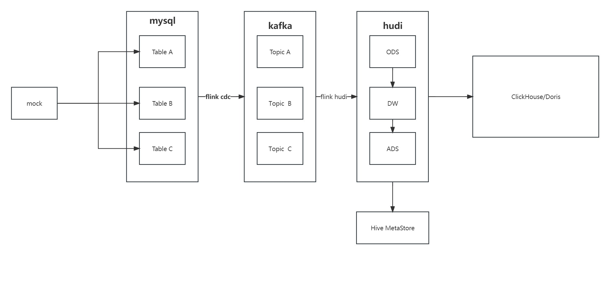

根据B站大佬语兴的视频初步构建的实时数仓练手项目

视频链接：https://space.bilibili.com/405479587/channel/collectiondetail?sid=1191377

初步规划架构图：

简要说明：
采用mock方式生产假数据到MySQL，flink cdc 实时获取MySQL binlog，写入数据到kafka，
经过多次分层和flink计算后，写入到报表库（暂定），后续考虑在离线部分加入数据湖（暂时偏向于hudi），后续再做详细修改